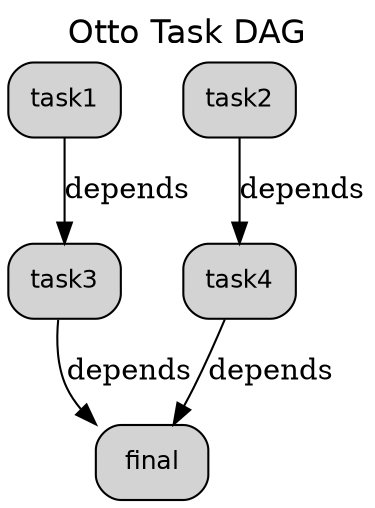

# Otto Graph Visualization Implementation Guide

This document provides comprehensive details about Otto's graph visualization system, including all dependencies, implementation specifics, and usage examples. This information is designed to help implement similar functionality in other projects.

## Overview

Otto's graph visualization system provides multiple output formats for visualizing task dependency graphs:
- **ASCII Terminal Output**: Custom-built tree visualization using Unicode box-drawing characters
- **Graphviz Integration**: SVG, PNG, PDF, and DOT format generation via external Graphviz binary
- **Built-in Meta-Task**: Seamlessly integrated as a `graph` command in the CLI

## Dependencies and Crates

### Core Rust Crates

```toml
[dependencies]
# Graph data structure
daggy = "0.9.0"

# Error handling
eyre = "0.6.12"

# Hashing for task identification
sha2 = "0.10.9"
hex = "0.4.3"

# Temporary file handling for Graphviz
tempfile = "3.20"

# Standard library extensions
std = { collections = "HashMap", path = "Path", process = "Command" }
```

### External System Dependencies

```bash
# For image generation (SVG, PNG, PDF)
# Ubuntu/Debian:
sudo apt install graphviz

# macOS:
brew install graphviz

# Windows:
# Download from https://graphviz.org/download/
```

## Core Data Structures

### Task Structure

```rust
#[derive(Clone, Debug, PartialEq, Eq)]
pub struct Task {
    pub name: String,
    pub task_deps: Vec<String>,      // Task dependencies
    pub file_deps: Vec<String>,      // File input dependencies
    pub output_deps: Vec<String>,    // File output dependencies
    pub envs: HashMap<String, String>,
    pub values: HashMap<String, Value>,
    pub action: String,
    pub hash: String,               // SHA256 hash of action (8 chars)
}
```

### DAG Type Definition

```rust
use daggy::Dag;
pub type DAG<T> = Dag<T, (), u32>;
```

## Graph Visualization Options

### GraphOptions Configuration

```rust
#[derive(Debug, Clone)]
pub struct GraphOptions {
    /// Include task details in nodes
    pub show_details: bool,
    /// Show file dependencies
    pub show_file_deps: bool,
    /// Output format preference
    pub format: GraphFormat,
    /// Node styling
    pub style: NodeStyle,
    /// Output file path (optional)
    pub output_path: Option<std::path::PathBuf>,
}
```

### Supported Formats

```rust
#[derive(Debug, Clone)]
pub enum GraphFormat {
    /// Generate SVG image (requires graphviz)
    Svg,
    /// Generate PNG image (requires graphviz)
    Png,
    /// Generate PDF (requires graphviz)
    Pdf,
    /// Raw DOT format
    Dot,
    /// ASCII art for terminal
    Ascii,
    /// Auto-detect based on file extension
    Auto,
}
```

### Node Styling Options

```rust
#[derive(Debug, Clone)]
pub enum NodeStyle {
    Simple,     // Just task name
    Detailed,   // Task name + inputs/outputs + hash
    Compact,    // Task name + short hash
}
```

## Implementation Details

### 1. ASCII Terminal Visualization

The ASCII output is **completely custom-built** using Unicode box-drawing characters:

```rust
pub fn generate_ascii(&self, dag: &DAG<Task>) -> Result<String> {
    let mut output = String::new();

    // Header with Unicode box characters
    output.push_str("┌─────────────────────────────────────┐\n");
    output.push_str("│           Otto Task DAG             │\n");
    output.push_str("└─────────────────────────────────────┘\n\n");

    // Find root tasks (no dependencies)
    let root_tasks: Vec<_> = dag.raw_nodes()
        .iter()
        .filter(|node| node.weight.task_deps.is_empty())
        .collect();

    if root_tasks.is_empty() {
        output.push_str("No root tasks found (possible circular dependencies)\n");
        return Ok(output);
    }

    // Render each root task and its subtree
    for (i, root) in root_tasks.iter().enumerate() {
        let is_last_root = i == root_tasks.len() - 1;
        self.render_ascii_subtree(
            &mut output,
            &root.weight,
            dag,
            0,
            &mut std::collections::HashSet::new(),
            is_last_root
        )?;
    }

    // Add legend
    output.push_str("\n┌─────────────────────────────────────┐\n");
    output.push_str("│ Legend:                             │\n");
    output.push_str("│ ├─ Task name [inputs:N] [outputs:M] │\n");
    output.push_str("│ └─ Dependencies flow top to bottom  │\n");
    output.push_str("└─────────────────────────────────────┘\n");

    Ok(output)
}
```

### 2. Recursive Tree Rendering

```rust
fn render_ascii_subtree(
    &self,
    output: &mut String,
    task: &Task,
    dag: &DAG<Task>,
    depth: usize,
    visited: &mut std::collections::HashSet<String>,
    is_last: bool
) -> Result<()> {
    let indent = "  ".repeat(depth);
    let connector = if is_last { "└─" } else { "├─" };

    // Circular dependency detection
    if visited.contains(&task.name) {
        output.push_str(&format!("{}{} {} (circular ref)\n", indent, connector, task.name));
        return Ok(());
    }

    visited.insert(task.name.clone());

    // Show task info with file dependency counts
    output.push_str(&format!("{}{} {}", indent, connector, task.name));
    if !task.file_deps.is_empty() {
        output.push_str(&format!(" [inputs:{}]", task.file_deps.len()));
    }
    if !task.output_deps.is_empty() {
        output.push_str(&format!(" [outputs:{}]", task.output_deps.len()));
    }
    output.push('\n');

    // Find tasks that depend on this one
    let dependents: Vec<_> = dag.raw_nodes()
        .iter()
        .filter(|node| node.weight.task_deps.contains(&task.name))
        .collect();

    // Recursively render dependents
    for (i, dependent) in dependents.iter().enumerate() {
        let is_last_dependent = i == dependents.len() - 1;
        self.render_ascii_subtree(
            output,
            &dependent.weight,
            dag,
            depth + 1,
            visited,
            is_last_dependent
        )?;
    }

    visited.remove(&task.name);
    Ok(())
}
```

### 3. Graphviz DOT Generation

```rust
pub fn generate_dot(&self, dag: &DAG<Task>) -> Result<String> {
    let mut dot = String::new();

    // DOT graph header
    dot.push_str("digraph otto_dag {\n");
    dot.push_str("  label=\"Otto Task DAG\";\n");
    dot.push_str("  labelloc=\"t\";\n");
    dot.push_str("  fontsize=\"16\";\n");
    dot.push_str("  fontname=\"Helvetica\";\n");
    dot.push_str("  rankdir=\"TB\";\n");
    dot.push_str("  bgcolor=\"white\";\n");
    dot.push_str("  \n");

    // Default node attributes
    dot.push_str("  node [\n");
    dot.push_str("    shape=\"box\",\n");
    dot.push_str("    style=\"rounded,filled\",\n");
    dot.push_str("    fontname=\"Helvetica\",\n");
    dot.push_str("    fontsize=\"12\"\n");
    dot.push_str("  ];\n");

    // Create task nodes
    let mut task_to_id = HashMap::new();
    for (idx, node) in dag.raw_nodes().iter().enumerate() {
        let task = &node.weight;
        let node_id = format!("task_{}", idx);
        task_to_id.insert(task.name.clone(), node_id.clone());

        let label = self.create_node_label(task);
        let escaped_label = self.escape_dot_string(&label);

        // Color nodes based on file dependencies
        let color = if !task.file_deps.is_empty() || !task.output_deps.is_empty() {
            "lightblue"
        } else {
            "lightgray"
        };

        dot.push_str(&format!(
            "  {} [label=\"{}\", fillcolor=\"{}\"];\n",
            node_id, escaped_label, color
        ));
    }

    // Add dependency edges
    for node in dag.raw_nodes() {
        let task = &node.weight;
        if let Some(target_id) = task_to_id.get(&task.name) {
            for dep_name in &task.task_deps {
                if let Some(source_id) = task_to_id.get(dep_name) {
                    dot.push_str(&format!(
                        "  {} -> {} [label=\"depends\", color=\"black\"];\n",
                        source_id, target_id
                    ));
                }
            }
        }
    }

    // Add file dependencies if enabled
    if self.options.show_file_deps {
        self.add_file_dependencies_to_dot(&mut dot, dag, &task_to_id, &mut file_nodes)?;
    }

    dot.push_str("}\n");
    Ok(dot)
}
```

### 4. Graphviz Integration

```rust
pub fn generate_image(&self, dag: &DAG<Task>) -> Result<String> {
    let dot_content = self.generate_dot(dag)?;
    let (format, output_path) = self.determine_output_format()?;

    // Check if graphviz is available
    if !self.is_graphviz_available() {
        return Err(eyre!(
            "Graphviz not found. Please install graphviz to generate images.\n\
            On Ubuntu/Debian: sudo apt install graphviz\n\
            On macOS: brew install graphviz\n\
            On Windows: Download from https://graphviz.org/download/\n\
            \n\
            Falling back to ASCII output:\n{}",
            self.generate_ascii(dag)?
        ));
    }

    // Create temporary DOT file
    let temp_dir = tempfile::tempdir()?;
    let dot_file = temp_dir.path().join("otto_graph.dot");
    std::fs::write(&dot_file, &dot_content)?;

    // Run graphviz to generate image
    let output = Command::new("dot")
        .arg(&format!("-T{}", format))
        .arg(&dot_file)
        .arg("-o")
        .arg(&output_path)
        .output()?;

    if !output.status.success() {
        let stderr = String::from_utf8_lossy(&output.stderr);
        return Err(eyre!("Graphviz failed: {}", stderr));
    }

    Ok(format!(
        "Graph visualization saved to: {}\n\
        Format: {}\n\
        Open with your preferred image viewer or browser.",
        output_path.display(),
        format.to_uppercase()
    ))
}
```

### 5. Graphviz Availability Check

```rust
fn is_graphviz_available(&self) -> bool {
    Command::new("dot")
        .arg("-V")
        .output()
        .map(|output| output.status.success())
        .unwrap_or(false)
}
```

## CLI Integration

### Meta-Task Injection

The graph command is implemented as a "meta-task" that gets injected into the task configuration:

```rust
fn inject_graph_meta_task(&mut self) {
    use crate::cfg::param::{ParamType, Nargs};

    let graph_task = TaskSpec {
        name: "graph".to_string(),
        help: Some("Visualize the task dependency graph".to_string()),
        after: vec![],
        before: vec![],
        input: vec![],
        output: vec![],
        envs: HashMap::new(),
        params: {
            let mut params = HashMap::new();

            // Add --format parameter
            params.insert("format".to_string(), ParamSpec {
                name: "format".to_string(),
                short: Some('f'),
                long: Some("format".to_string()),
                param_type: ParamType::OPT,
                dest: None,
                metavar: None,
                default: Some("ascii".to_string()),
                constant: Value::Empty,
                choices: vec!["ascii".to_string(), "dot".to_string(), "svg".to_string(), "png".to_string(), "pdf".to_string()],
                nargs: Nargs::One,
                help: Some("Output format".to_string()),
                value: Value::Empty,
            });

            // Add --output parameter
            params.insert("output".to_string(), ParamSpec {
                name: "output".to_string(),
                short: None,
                long: Some("output".to_string()),
                param_type: ParamType::OPT,
                dest: None,
                metavar: None,
                default: None,
                constant: Value::Empty,
                choices: vec![],
                nargs: Nargs::One,
                help: Some("Output file path".to_string()),
                value: Value::Empty,
            });

            params
        },
        action: "# Built-in graph command".to_string(),
    };

    self.config_spec.tasks.insert("graph".to_string(), graph_task);
}
```

### Task Name Recognition

The graph command is recognized as a task name during parsing:

```rust
// Include both configured tasks AND built-in meta-tasks like "graph"
let mut task_names: Vec<&str> = self.config_spec.tasks.keys().map(String::as_str).collect();
task_names.push("graph"); // Always include graph as a built-in task name
```

## Usage Examples

### Basic Usage

```bash
# Generate ASCII output (default)
otto graph

# Generate SVG image
otto graph --format svg

# Generate PNG image with custom output path
otto graph --format png --output dependency-graph.png

# Generate DOT format for further processing
otto graph --format dot --output graph.dot

# Generate PDF
otto graph --format pdf --output report.pdf
```

### Expected Output

#### ASCII Format
```
┌─────────────────────────────────────┐
│           Otto Task DAG             │
└─────────────────────────────────────┘

├─ task2
  └─ task4
    └─ final
└─ task1
  └─ task3
    └─ final

┌─────────────────────────────────────┐
│ Legend:                             │
│ ├─ Task name [inputs:N] [outputs:M] │
│ └─ Dependencies flow top to bottom  │
└─────────────────────────────────────┘
```

#### DOT Format


## Key Features

### 1. No External Crates for ASCII
- **Custom Implementation**: The terminal ASCII output is built entirely from scratch
- **Unicode Box Drawing**: Uses `┌─`, `├─`, `└─`, `│` characters for tree structure
- **Circular Dependency Detection**: Prevents infinite loops in graph traversal
- **File Dependency Counts**: Shows `[inputs:N]` and `[outputs:M]` annotations

### 2. Graphviz Integration
- **Multiple Formats**: SVG, PNG, PDF, DOT support
- **Automatic Fallback**: Falls back to ASCII if Graphviz not available
- **Temporary File Management**: Uses `tempfile` crate for safe DOT file handling
- **Error Handling**: Comprehensive error messages with installation instructions

### 3. CLI Integration
- **Meta-Task Pattern**: Seamlessly integrated as a regular task
- **Parameter Support**: `--format` and `--output` parameters with validation
- **Help Integration**: Full help support with `otto graph --help`
- **Task Name Recognition**: Recognized alongside user-defined tasks

### 4. File Dependency Visualization
- **Input/Output Files**: Shows file dependencies as separate nodes
- **Color Coding**: Different colors for tasks vs. files
- **Glob Pattern Support**: Handles complex file patterns
- **Canonical Paths**: Resolves to absolute paths for consistency

## Implementation Notes

### 1. String Escaping for DOT
```rust
fn escape_dot_string(&self, s: &str) -> String {
    s.replace('\\', "\\\\")
        .replace('"', "\\\"")
        .replace('\n', "\\n")
        .replace('\r', "\\r")
        .replace('\t', "\\t")
        .replace('$', "\\$")
        .replace('{', "\\{")
        .replace('}', "\\}")
}
```

### 2. Node Color Logic
```rust
let color = if !task.file_deps.is_empty() || !task.output_deps.is_empty() {
    "lightblue"  // Tasks with file dependencies
} else {
    "lightgray"  // Simple tasks
};
```

### 3. Output Path Determination
```rust
fn determine_output_format(&self) -> Result<(String, std::path::PathBuf)> {
    let (format, extension) = match &self.options.format {
        GraphFormat::Svg => ("svg", "svg"),
        GraphFormat::Png => ("png", "png"),
        GraphFormat::Pdf => ("pdf", "pdf"),
        GraphFormat::Auto => {
            // Auto-detect from file extension
            if let Some(ref path) = self.options.output_path {
                match path.extension().and_then(|s| s.to_str()) {
                    Some("svg") => ("svg", "svg"),
                    Some("png") => ("png", "png"),
                    Some("pdf") => ("pdf", "pdf"),
                    _ => ("svg", "svg"), // default
                }
            } else {
                ("svg", "svg") // default
            }
        },
        _ => return Err(eyre!("Invalid format for image generation")),
    };

    let output_path = if let Some(ref path) = self.options.output_path {
        path.clone()
    } else {
        std::env::current_dir()?.join(format!("otto_graph.{}", extension))
    };

    Ok((format.to_string(), output_path))
}
```

## Testing

### Unit Tests
```rust
#[test]
fn test_ascii_generation() -> Result<()> {
    let mut dag = DAG::new();

    let task1 = create_test_task("setup", vec![]);
    let task2 = create_test_task("build", vec!["setup"]);
    let task3 = create_test_task("test", vec!["build"]);

    dag.add_node(task1);
    dag.add_node(task2);
    dag.add_node(task3);

    let visualizer = DagVisualizer::with_defaults();
    let ascii = visualizer.generate_ascii(&dag)?;

    assert!(ascii.contains("Otto Task DAG"));
    assert!(ascii.contains("setup"));
    assert!(ascii.contains("build"));
    assert!(ascii.contains("test"));
    assert!(ascii.contains("Legend"));

    Ok(())
}
```

## Performance Considerations

### 1. Memory Usage
- **Visited Set**: Uses `HashSet<String>` to track visited nodes during traversal
- **String Building**: Efficient string concatenation with pre-allocated capacity
- **Temporary Files**: Automatic cleanup via `tempfile` crate

### 2. Time Complexity
- **ASCII Generation**: O(n) where n is number of tasks
- **DOT Generation**: O(n + e) where e is number of edges
- **Graphviz Execution**: External process, depends on graph complexity

### 3. Error Handling
- **Graceful Degradation**: Falls back to ASCII if Graphviz unavailable
- **Comprehensive Messages**: Detailed error messages with installation instructions
- **Circular Dependency Detection**: Prevents infinite loops

## Future Enhancements

### 1. Additional Formats
- **Mermaid**: Popular markdown-compatible diagram format
- **PlantUML**: UML-style diagrams
- **JSON**: Machine-readable format for further processing

### 2. Interactive Features
- **Web Interface**: HTML output with interactive navigation
- **Filtering**: Show/hide specific task types or dependencies
- **Zoom/Pan**: For large graphs

### 3. Styling Options
- **Custom Colors**: User-defined color schemes
- **Layout Options**: Different graph layouts (horizontal, circular)
- **Font Customization**: Custom fonts and sizes

## Conclusion

Otto's graph visualization system demonstrates a well-architected approach to multi-format graph rendering:

1. **Custom ASCII Implementation**: No external dependencies for terminal output
2. **Graphviz Integration**: Leverages industry-standard tool for high-quality images
3. **Seamless CLI Integration**: Implemented as a meta-task with full parameter support
4. **Comprehensive Error Handling**: Graceful fallbacks and helpful error messages
5. **Extensible Design**: Easy to add new formats and features

The combination of custom ASCII rendering and Graphviz integration provides both immediate terminal feedback and publication-quality output, making it suitable for both development workflows and documentation generation.
